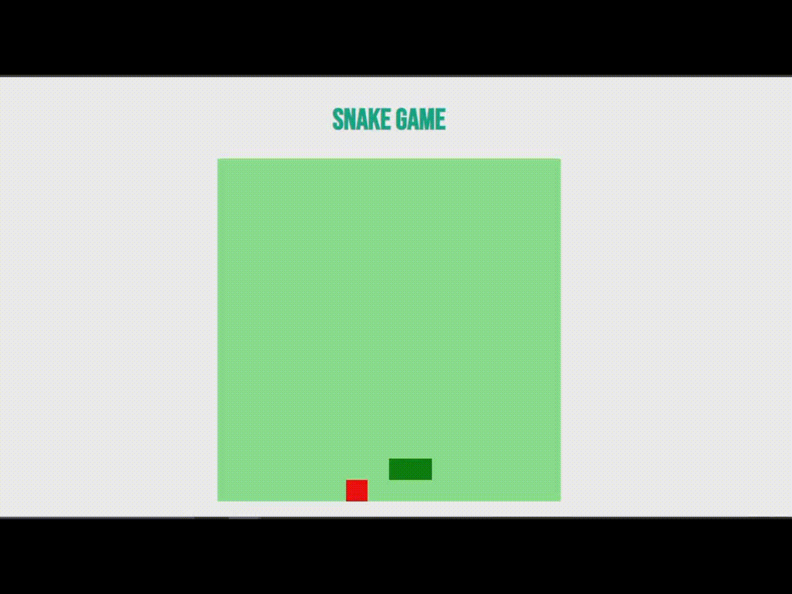

<h1 align="center" id="Titulo"> Snake Game </h1>

<h4 align="center" id="Descricao"> 🧾 Descrição do Projeto 📜</h4>

Feito com as principais tecnologias de desenvolvimeto web, nesse projeto, proposto e orientado como parte do <code>BOOTCAMP</code> de <code>HTML WEB DEVELOPER</code> da <a href="https://digitalinnovation.one"> Digital Innovation One</a>, desenvolve-se uma versão simplificada e dinâmica do jogo Snake Game, famigeradamente conhecico domo <i>"Jogo da Cobrinha".</i>

 

  
  
  
  
  

****

<b id="Status">🚀 STATUS DO PROJETO 🚀</b> 

 <b>🌀 <i>Programando...</i> 🌀 </b> 

 <b>⏳ ■■■■■■■■■■■□□□⏳</b> 

****

#### 📰 Índice

- [Título](#Titulo)
- [Descrição](#Descricao)
- [Status do Projeto](#Status)
- [Demonstração](#Titulo)
- [Funcionalidades]()
- [Pré-requisitos](#Pre-Requisitos)
- [Dependências]()
- [Como rodar a aplicação]()
- 

****

#### 🎥 Demonstração

> Essa é a aparência da tela do jogo atualmente e como mais ou menos está funcionando: 

> Basicamente, somente da para controlar a cobrinha e fazê-la comer a "comidinha", sendo que o jogo finaliza caso a cabeça da cobrinha se dê de encontro com seu corpo.

****

#### ⚙️ Funcionalidades

- [x] Jogável
  - [x] Controlar a cobrinha.
  - [ ] Aleatorizar a comidinha.  
  - [ ] Exibir tela de game over.
  - [ ] Exibir opção de reiniciar partida.
  - [ ] Armazenar maior recorde do jogador.
  - [ ] Acréscimo de pontos após pegar a comida.
  - [x] Finalizar jogo após entrar em contato com o proprio corpo.
- [ ] Responsividade. 
- [ ] Exibir pontuação e maior pontuação.

****

#### 🔌 Dependências